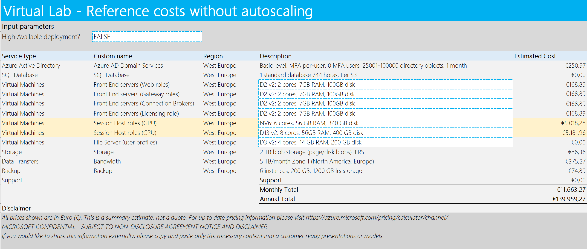
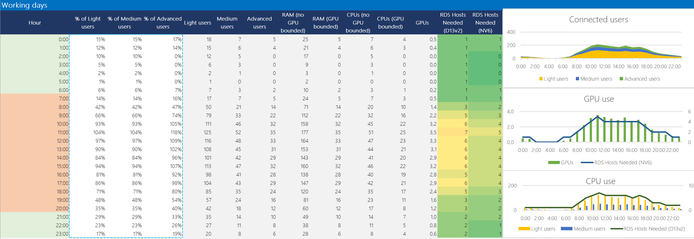
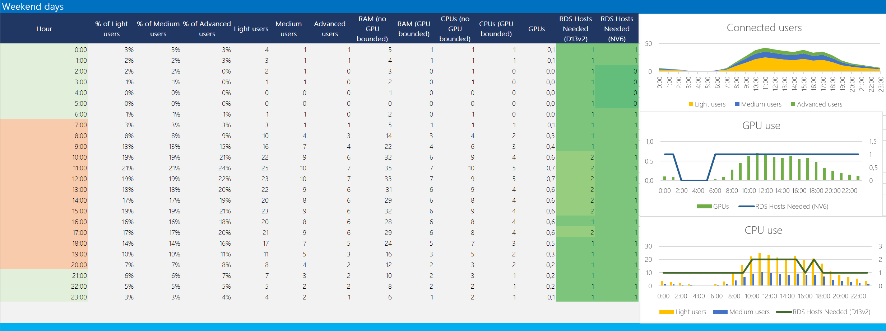
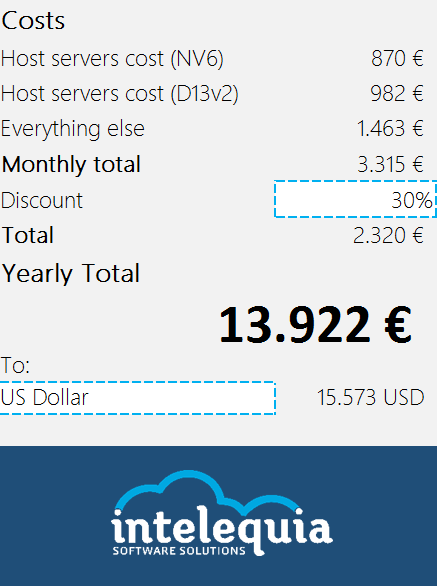

# Introduction
---
* Introduction
    * [Business needs](/README.md)
    * **[Costs simulator](./Virtual-Lab-Cost-Simulator.md)** <--
* [Architecture](/Documentation/ArchitectureDiagram.md)
* [Deployment](/Documentation/Deployment-basic.md)
* [Admin Guide](/Documentation/RemoteDesktopRemoteApp.md)
* [User Guide](./Documentation/UserGuide.md)
---

# Virtual Lab costs simulator tool

[Download the virtual lab costs simulator tool (Virtual Lab Cost Simulator v1.2.xlsx)](Virtual%20Lab%20Cost%20Simulator%20v1.2.xlsx)

Once we have introduced the concept of lab virtualization on a public cloud, there is an important question to answer: how much would cost this solution?

It is not an easy question to answer, because there are some variables playing:

- How many users I will support?
- How many concurrent users?
- My users, do they have the same profile or they consume more resources depending on the classroom or course? Are all of them going to use the power of GPU computing or a group of them are light users with some basic apps?
- Do I want to offer a high available solution?
- How many days per year I will have the solution turned on?
- Is there any discount I can apply?

These are some of those variables, but then, &quot;thinking cloud&quot;, we could also try to optimize the deployment and implement an automatic scaled version of the RDS deployment, so then other variables come to play:

- How many concurrent users will be connected depending on the time of the day?
- How many concurrent users will be connected over weekend days?

Answering all these questions is not an easy task. To make it easier, we have built a cost estimation tool that, while not being perfect, can give you an idea of how much your deployment is going to cost per month or per year. We will be improving the tool frequently, so keep an eye to updates and announcements that will be published on this same repository.

The tool is an [Excel workbook](Virtual Lab Cost Simulator v1.2.xlsx] with the following worksheets:

- **Costs**: gives you an estimate of how much your deployment would cost with no autoscaling implementation;
- **Inputs**: gives you an estimate for your deployment if you introduce autoscaling on the session hosts depending on your users&#39; workload;
- **Reference data**: just a worksheet with reference data such as VM pricing

Let&#39;s take a deeper look to each one

# Reference costs without autoscaling

After opening the virtual lab cost estimation tool, you will see some worksheets. On the &quot;Costs&quot; worksheet, you can play with some variables to start getting an estimation:

- **High available deployment**: depending on the deployment type (basic or advanced with high availability), there are some costs that change. In some cases, will be related to just one or two VMs per tier, but also the type of database or storage to use.
- **Virtual Machine SKUs**: you can specify here the VM SKU for each tier. Depending on your user load, you would like to use bigger or smaller virtual machines. One important aspect here is, while the web/gateway/broker roles depend on the HA variable to just double the cost, the session hosts estimate depends on the parameters introduced on the &quot;Inputs&quot; worksheet. This is, the necessary VMs to host all your users load depending on their profile, and with no autoscaling implemented, just with the hosts VMs turned on all the days of the year. Because of this, when changing the parameters later on the &quot;Inputs&quot; tab, you will see the session hosts rows changing their estimated cost.

 

# Estimated costs with autoscaling

The second worksheet will allow you to customize your costs by introducing autoscaling. This will help you, after introducing some common variables, give you an idea of how much would cost your deployment and how much you can save if you implement an autoscaling solution.

## Common parameters

The parameters to introduce are:

- **Total users:** the number of total users you will be supporting with the virtual lab solution;
- **% of concurrent users:** the percentage of concurrent users that will access the virtual lab based on the total number mentioned above;
- **% of weekend users:** the percentage of users that will be connected during weekend days depending on the % of concurrent users;
- **% of users per type:** the percentage of user base depending on the user profile. We have differentiated between three types of users (you can simplify this depending on your needs), allowing you to customize the resources needed for each user tier. As example: a light user can typically just use light applications such as text processors; medium users can include some more sophisticated application consuming more CPU or memory; advanced users can include the use of GPU computation in some applications. You can customize the user type by filling the users&#39; inputs:
  - **RAM:** the total estimated memory in GB per user per tier;
  - **CPU:** the percentage of CPU used per user per tier. Microsoft recommends between 1 and 10 users per core;
  - **GPU:** the percentage of GPU used per user per tier. As in the case of CPUs, the percentage will vary depending on the type of applications being deployed, so the same 1-10 per GPU rule can apply;
- **Days per year:** the number of days per year that the virtual lab will be turned on. The idea is you can completely turn off the deployment and save money on those days. For example, if you just plan to keep it turned on during 4 months, just type 120 days.

 

## Concurrent users per hour on working days

The next parameters to introduce are the percentage of users per tier that will be concurrently connected per hour. To help you on this task, we have pre-filled the fields with some typical usage, but feel free to change the values depending on your estimation.

 

After introducing those values, all the other data is automatically populated:

- Number of users connected per hour and per tier
- The needed RAM to be consumed by all your users
- The number of CPUs and GPUs needed
- Number of session hosts needed, depending on the user load. We have differentiated between two type of session hosts (with GPU needs and with no GPU needs), because VMs with no GPUs are around 30% cheaper. Note that we have introduced colors depending on the number of VMs needed, that will vary from green-yellow-red between the range 0-12. If you need more than 12 VMs for a session host, would be better to just use a bigger VM SKU specified on the &quot;Costs&quot; worksheet simplifying your deployment.
- Some graphs showing all the previously mentioned data

Note that the weekend estimations are automatically calculated as well depending on the &quot;% of weekend users&quot; variable. You don&#39;t need to modify anything on it:

 

## Cost estimation

The final part is the box summarizing the total costs with autoscaling enabled. Note that the session host tiers will automatically reflect the type of VM SKU selected for them.

- Host servers cost (GPU VM tier): will show the estimate for the session host servers using GPUs;
- Host server cost (CPU VM tier): will show the estimate for the session host servers just using CPUs and memory, with no GPU usage;
- Everything else: just the summary of all the other costs shown on the &quot;Costs&quot; worksheet
- Discount: all the prices are calculated by using the public pricing available on the Azure site. If you can apply for a discount, introduce here the negotiated discount.

 

We have added a simple exchange rate conversion. Feel free to use your own exchange rate calculator for updated exchange rates and other currencies not listed.

---
* Introduction
    * [Business needs](/README.md)
    * **[Costs simulator](./Virtual-Lab-Cost-Simulator.md)** <--
* [Architecture](/Documentation/ArchitectureDiagram.md)
* [Deployment](/Documentation/Deployment-basic.md)
* [Admin Guide](/Documentation/RemoteDesktopRemoteApp.md)
* [User Guide](./Documentation/UserGuide.md)
---
