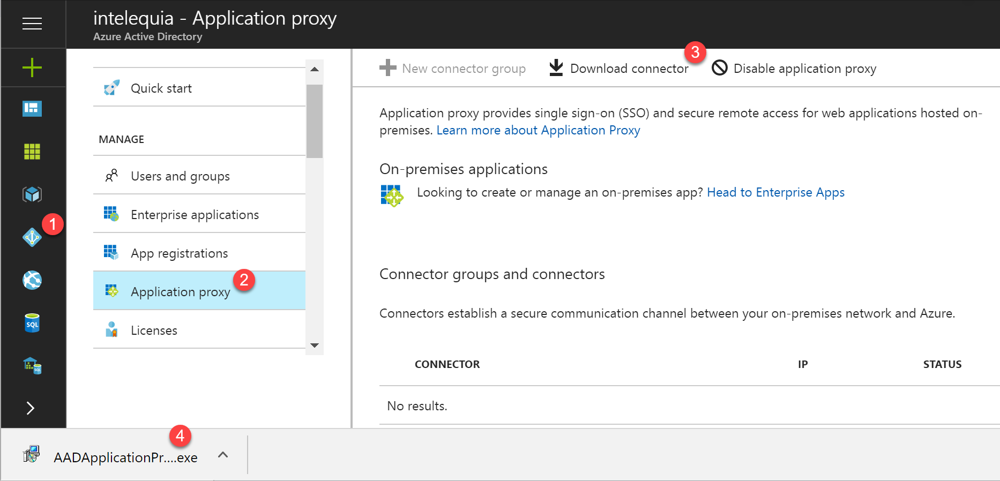

# Admin Guide
---
* [Introduction](./README.md)
* [Architecture](./ArchitectureDiagram.md)
* [Deployment](./Deployment-basic.md)
* Admin Guide
    * [Remote Desktop - RemoteApp](./RemoteDesktopRemoteApp.md)
    * [RemoteFX](./RemoteFX.md)
    * **[Azure AD Proxy](./AzureADProxy.md)**<--
    * [Create Additional Collection](./CreateSessionCollection.md)
* [User Guide](./UserAccess.md) 
---
## Azure AD Proxy
If you want to reduce the attack surface of your deployment by using Azure AD Application Proxy. This scenario gives a limited set of two-step verification and conditional access controls to RDS.

This Application Proxy scenario has a permanent outbound connection from the server running the connector service.The other deployments leave open inbound connections through a load balancer.

### Requirements
Your end users can only access this scenario through Windows 7 and Windows 10 desktops that connect through the RD Web page. This scenario is unsupported on other operating systems, even those with the Microsoft Remote Desktop applications.

Your end users need to use Internet Explorer and enable the RDS ActiveX add-on when connecting to their resources.

### Install and register a connector
1. Sign in as an administrator in the Azure portal.
2. Your current directory appears under your username in the top right corner. If you need to change directories, select that icon.
3. Go to Azure Active Directory > Application Proxy > Select Download Connector  
  
4. Run AADApplicationProxyConnectorInstaller.exe on the server you prepared according to the prerequisites, in our case it is RDFE-VM01*..n*.
5. Follow the instructions in the wizard to install.  
During installation, you are prompted to register the connector with the Application Proxy of your Azure AD tenant.
Provide your Azure AD global administrator credentials. Your global administrator tenant may be different from your Microsoft Azure credentials.  
  
Make sure the admin who registers the connector is in the same directory where you enabled the Application Proxy service. For example, if the tenant domain is contoso.com, the admin should be admin@contoso.com or any other alias on that domain.

When the installation completes, two new services are added to your server:
* Microsoft AAD Application Proxy Connector enables connectivity
* Microsoft AAD Application Proxy Connector Updater is an automated update service, which periodically checks for new versions of the connector and updates the connector as needed.

### Publish the RD host endpoint
1. Publish an on-premises app for remote access
    * Sign in as an administrator in the Azure portal.
    * Select Azure Active Directory > Enterprise applications > New application.  
    
    * On the Categories page, select On-premises application.  
    
    * Provide the following information about your application:
        1. Internal URL: https://<rdhost>.com/, where <rdhost> is the common root that RD Web and RD Gateway share.
        2. External URL: This field is automatically populated based on the name of the application, but you can modify it. Your users will go to this URL when they access RDS.
        3. Preauthentication method: Azure Active Directory
        4. Translate URL headers: No
2. Assign users to the published RD application. Make sure they all have access to RDS, too.  

3. Leave the single sign-on method for the application as Azure AD single sign-on disabled. Your users are asked to authenticate once to Azure AD and once to RD Web, but have single sign-on to RD Gateway.
4. Go to Azure Active Directory > App Registrations > Your application > Settings.
5. Select Properties and update the Home-page URL field to point to your RD Web endpoint (like https://<rdhost>.com/RDWeb).

### Direct RDS traffic to Application Proxy
Connect to the RDS deployment as an administrator and change the RD Gateway server name for the deployment. This ensures that connections go through the Azure AD Application Proxy.
1. Connect to the RDS server running the RD Connection Broker role.
2. Launch Server Manager.
3. Select Remote Desktop Services from the pane on the left.
4. Select Overview.
5. In the Deployment Overview section, select the drop-down menu and choose Edit deployment properties.
6. In the RD Gateway tab, change the Server name field to the External URL that you set for the RD host endpoint in Application Proxy.
7. Change the Logon method field to Password Authentication.
8. For each collection, run the following command. Replace <yourcollectionname> and <proxyfrontendurl> with your own information. This command enables single sign-on between RD Web and RD Gateway, and optimizes performance:

```
Set-RDSessionCollectionConfiguration -CollectionName "<yourcollectionname>" -CustomRdpProperty "pre-authentication server address:s: <proxyfrontendurl> `n require pre-authentication:i:1"
```

Now that you've configured Remote Desktop, Azure AD Application Proxy has taken over as the internet-facing component of RDS. You can remove the other public internet-facing endpoints on your RD Web and RD Gateway machines

### Test the scenario
Test the scenario with Internet Explorer on a Windows 7 or 10 computer.
1. Go to the external URL you set up, or find your application in the MyApps panel.
2. You are asked to authenticate to Azure Active Directory. Use an account that you assigned to the application.
3. You are asked to authenticate to RD Web.
4. Once your RDS authentication succeeds, you can select the desktop or application you want, and start working.

If you want to know more..  
[Publish Remote Desktop with Azure AD Application Proxy](https://docs.microsoft.com/en-us/azure/active-directory/application-proxy-publish-remote-desktop)  
[Get started with Application Proxy and install the connector](https://docs.microsoft.com/en-us/azure/active-directory/active-directory-application-proxy-enable)  
[Publish applications using Azure AD Application Proxy](https://docs.microsoft.com/en-us/azure/active-directory/application-proxy-publish-azure-portal)  

---
* [Introduction](./README.md)
* [Architecture](./ArchitectureDiagram.md)
* [Deployment](./Deployment-basic.md)
* Admin Guide
    * [Remote Desktop - RemoteApp](./RemoteDesktopRemoteApp.md)
    * [RemoteFX](./RemoteFX.md)
    * **[Azure AD Proxy](./AzureADProxy.md)**<--
    * [Create Additional Collection](./CreateSessionCollection.md)
* [User Guide](./UserAccess.md) 
---
