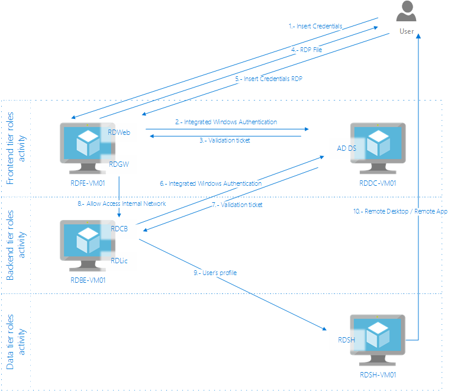

# Architecture
---
* [Introduction](/README.md)
* Architecture
    * [Architecture Diagrams](./ArchitectureDiagram.md)
    * [Other Architectures](./OtherArchitectures.md)
    * **[Architecture FlowChart](./RDSFlowChart.md)** <--
* [Deployment](./Deployment-basic.md)
* [Admin Guide](./RemoteAppSessionHost.md)
---

##RDS Flow Chart

Let's now talk about what happens when a user accesses the RDS infrastructure:

He will first come in through the public internet and connect to the RDWeb server. 
The user will visualize a user interface in which he will enter his credentials.

While the user log in he will be authenticated against the AD server. As a result, he will see resources on the webpage that have been published by the administrator (either specifically for the user or for a group of users where he belongs to).

Upon selecting one of the resources, an RDP file will be downloaded. Once the RDP file runs in the local device, it will connect thru the gateway to the broker.

The broker will first decide which session host the user will connect to (in this case, as we are deploying a basic RDS scenario, there is only one VM but it is possiblento have a farm of multiple sessions host for this collection).

Right after this and right before the user logs in, the user’s profile disk will be mounted to that VM and the user will be redirected so as to connect to the session host. After that, the user will be logged on and he can see his or her data from the profile disk.

If you want to learn more...

- [integrated Windows authentication](https://technet.microsoft.com/en-us/library/cc732841)

---
* [Introduction](/README.md)
* Architecture
    * [Architecture Diagrams](./ArchitectureDiagram.md)
    * [Other Architectures](./OtherArchitectures.md)
    * **[Architecture FlowChart](./RDSFlowChart.md)** <--
* [Deployment](./Deployment-basic.md)
* [Admin Guide](./RemoteAppSessionHost.md)
---