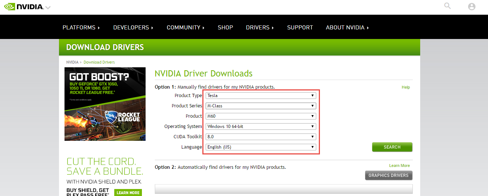
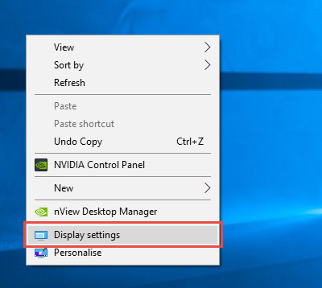
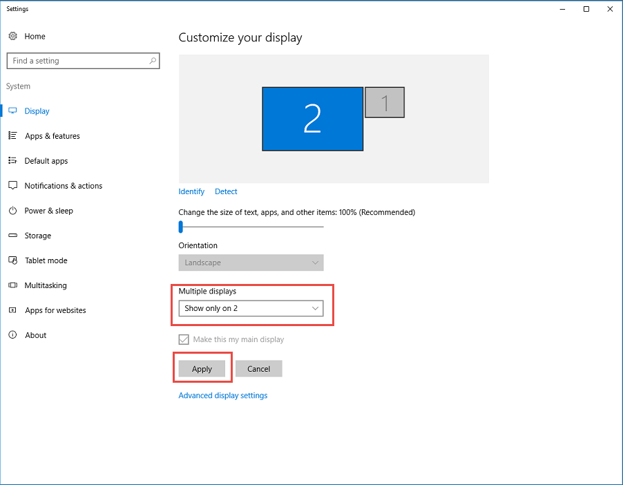

# Deployment
## Admin Guide
---
* [Introduction](./README.md)
* [Architecture](./ArchitectureDiagram.md)
* [Deployment](./Deployment-basic.md)
* Admin Guide
    * [Remote Desktop - RemoteApp](./RemoteDesktopRemoteApp.md)
    * [Certificate instalation](./UserAccessWebCert.md)
    * **[RemoteFX](./RemoteFX.md)**<--
    * [Create Aditional Collection](./CreateSessionCollection.md)
* [User Guide](./UserGuide.md)
---

### RemoteFX

Microsoft® RemoteFX™ enables access to the Host de sesión de Escritorio remoto server from a wide range of client devices including rich clients, thin clients, and ultrathin clients. It also ensures lower bandwidth than Windows Server® 2008 R2 when transferring rich graphics applications. When used with a hardware-based application-specific integrated circuit (ASIC), the server running Windows Server 2008 R2 with SP1 is capable of hosting more sessions than previous versions.

### Installation

1. Connect to the Session Host VM.

2. We have to open the **Device Manager**, we'll notice that the driver for M60 video card will be missing.

   

3. Install the lastest [NVIDIA Drivers](http://www.nvidia.com/download/index.aspx).
         
    

4. After rebooting the VM, we have to disable the default display adapter.
    * Expand ‘Display adapters’, right click on ‘Microsoft Hyper-V Video’ and select ‘Disable’. 
    
    

5. Now we have to use only the main display and disable the second one. To configure this option we have to access to the VM using VNC.
    * We recommended [TightVNC](http://www.tightvnc.com/download.php). In the last step in the server installation, it will open the firewall ports. **Remember to open the port in the Network Security Group.**

    

6. After log in using VNC. 
    * We can see both displays.
     
     
    
7. Righ click on Desktop > "Display Settings".

     
8. Select "Show only on 2" in the Multiple display and "Apply".

    
---
* [Introduction](./README.md)
* [Architecture](./ArchitectureDiagram.md)
* [Deployment](./Deployment-basic.md)
* Admin Guide
    * [Remote Desktop - RemoteApp](./RemoteDesktopRemoteApp.md)
    * [Certificate instalation](./UserAccessWebCert.md)
    * **[RemoteFX](./RemoteFX.md)**<--
    * [Create Aditional Collection](./CreateSessionCollection.md)
* [User Guide](./UserGuide.md)
---
