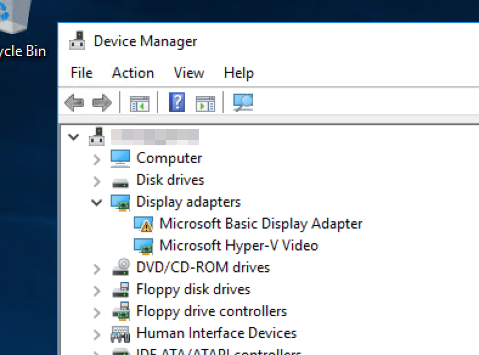
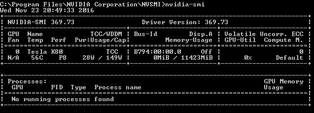

# Setting up RemoteFX on N-Series

Microsoft® RemoteFX™ enables access to the RDS Host Server from a wide range of client devices including rich clients, thin clients, and ultrathin clients. It also ensures lower bandwidth than Windows Server® when transferring rich graphics applications. When used with a hardware-based application-specific integrated circuit (ASIC), the server running Windows Server is capable of hosting more sessions than previous versions.

To take advantage of the GPU capabilities, you must install NVIDIA graphics drivers on each VM after deployment.

## Supported GPU drivers
Connect by Remote Desktop to each N-series VM. Download, extract, and install the supported driver for your Windows operating system +
NVIDIA Tesla drivers for NV VMs (Tesla M60)

## Driver  NVIDIA 

#### NVIDIA GRID drivers for NV VMs (Tesla M60)
Windows Server 2016	[Download](https://go.microsoft.com/fwlink/?linkid=836843). 

   NOTE: check for the latest instructions available on the [Azure Documentation Portal](https://docs.microsoft.com/en-us/azure/virtual-machines/windows/n-series-driver-setup) and [NVIDIA](http://www.nvidia.com/) website.

### Installation

1. Connect to the Session Host VM.
2. We have to open the **Device Manager**, we'll notice that the driver for M60 video card will be missing.
   
3. Install the lastest [NVIDIA Drivers](http://www.nvidia.com/download/index.aspx).   
4. Optional. After rebooting the VM, if you want to ensure all the apps uses the NVIDIA driver, disable the default display adapter.
    * Expand ‘Display adapters’, right click on ‘Microsoft Hyper-V Video’ and select ‘Disable’.     
    
    
### Verify GPU driver installation
On Azure NV VMs, a restart is required after driver installation. To query the GPU device state, run the [nvidia-smi](https://developer.nvidia.com/nvidia-system-management-interface) command-line utility installed with the driver.

  
### Group Policy settings
   * The following Group Policy settings allow you to configure RemoteFX within your environment:   

| Group Policy setting name | Location | Description | Default value |
| :---  | :---  | :--- | :---  |
| Configure RemoteFX        | Computer Configuration\Administrative Templates\Windows Components\Remote Desktop Services\Remote Desktop Session Host \Remote Session Environment | Enable and disable RemoteFX. | If you do not configure this policy setting, the default behavior will be used. By default, RemoteFX for RD Virtualization Host is enabled and RemoteFX for RD Session Host is disabled. |
| Optimize visual experience when using RemoteFX | Computer Configuration\Administrative Templates\Windows Components\Remote Desktop Services\Remote Desktop Session Host \Remote Session Environment | Specify the visual experience that users will have when connecting to RemoteFX-enabled sessions. | By default, Remote Desktop Connection sessions that use RemoteFX are optimized for a balanced experience over LAN conditions. If you disable or do not configure this policy setting, Remote Desktop Connection sessions that use RemoteFX will be the same as if the medium screen capture rate and the medium image compression settings were selected (the default behavior). |
|Allow RDP redirection of other supported RemoteFX USB devices from this computer | Computer Configuration\Administrative Templates\Windows Components\Remote Desktop Services\Remote Desktop Connection Client\RemoteFX USB Redirection | Permit redirection of supported RemoteFX USB devices. | Not configured |
| Do not allow supported Plug and Play device redirection | Computer Configuration\Administrative Templates\Windows Components\Remote Desktop Services\Remote Desktop Session Host \Device and Resource Redirection | Disable Plug and Play device redirection and RemoteFX USB redirection. | Not configured |

