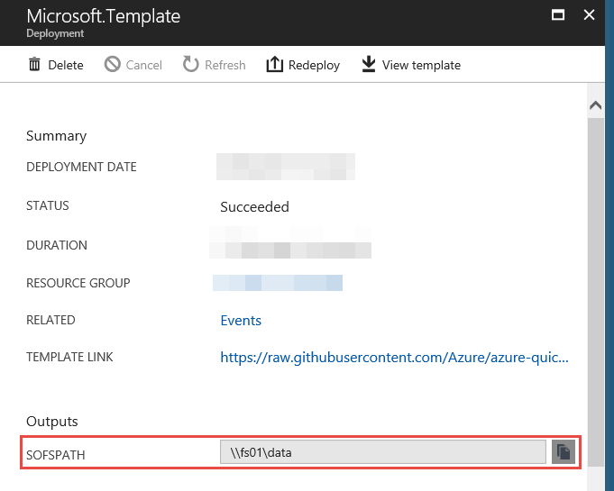

# Storage Spaces Direct (S2D) Scale-Out File Server (SOFS) Cluster
---
Remote Desktop Services (RDS) requires a domain-joined file server for user profile disks (UPDs). To deploy a high availability domain-joined scale-out file server (SOFS) in Azure, use Storage Spaces Direct (S2D) with Windows Server 2016.

## Installation

We are going to deploy this architecture from the last template published from Microsoft, but if you want to deploy it manually you can follow this [guide.](https://docs.microsoft.com/es-es/windows-server/remote/remote-desktop-services/rds-storage-spaces-direct-deployment)

1. [Create a Storage Spaces Direct (S2D) Scale-Out File Server (SOFS) Cluster with Windows Server 2016 on an existing VNET](https://github.com/Azure/azure-quickstart-templates/tree/master/301-storage-spaces-direct)

    * Remember the parameters:
    

2. After the deployment you can use the path that show the output of the previous deploy.
    * Output example: **\\\\sofsName\\shareName**
    
    
3. In Server Manager, click Remote Desktop Services > Collections > **Your Collection** > TASKS > "Edit Properties".
    
    
4. In the the "User Profile Disks".
    * Select **Enable user profiles disks**
    * In the **Location** field, we have to use the deploy output. Example: **\\\\sofsName\\shareName**
    
    
    
