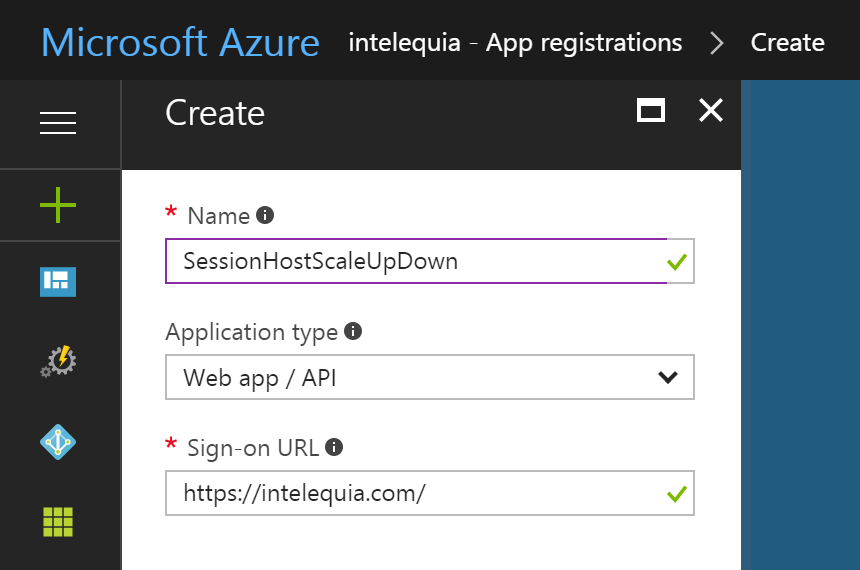
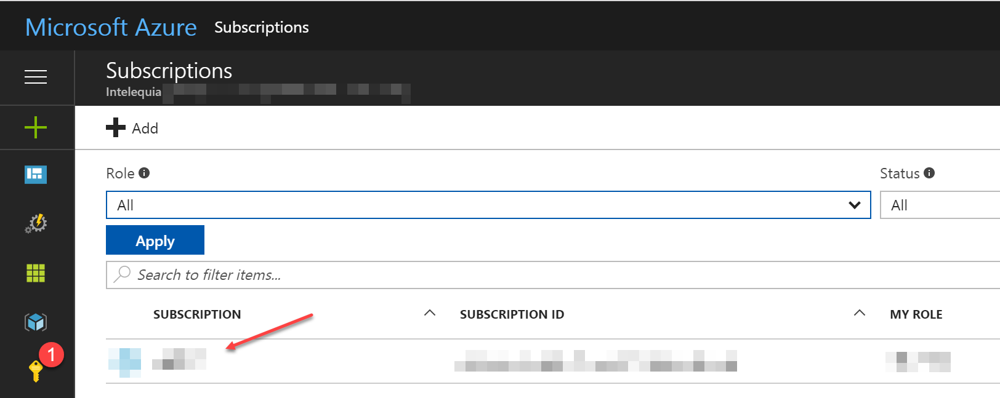
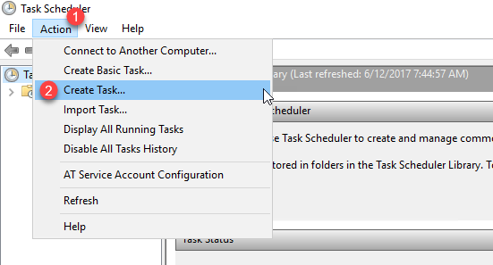
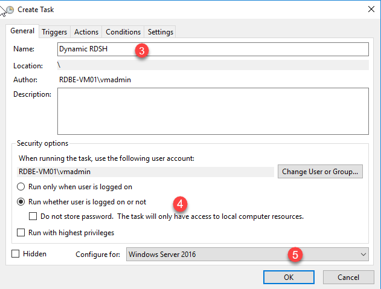
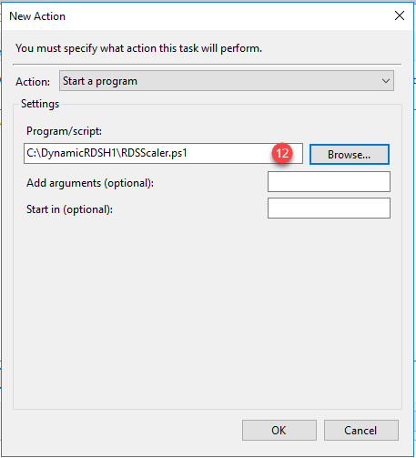

# Automated Remote Session Hosts scale up/down
Once we have our RDS deployment, we would like to setup Remote Desktop Session Host autoscaling depending on connections in our Connection Broker, so we can deliver more power during logon storms and then scale down after those peaks. This tutorial follows [Microsoft steps](https://gallery.technet.microsoft.com/scriptcenter/Automatic-Scaling-of-9b4f5e76), allowing you to setup automatic Remote Desktop Session Host scale up/down by using Azure Automation. While this is showing how to automate depending on the user workload, you can setup an schedule on the workbook to scale up Remote Desktop Session Host before the storm occurs.

## Prerequisites
The environment to be used to execute the script must meet the following requirements.

1. An RDS deployment in Azure under Azure Resource Manager mode with 2 or more RDSH servers in a collection, and each Azure virtual machine name has the same name as the hostname of the operating system running on that virtual machine.
2. Internet access from the Remote Desktop Connection Broker (RD Connection Broker) server.
3. PowerShell 4.0 or higher (default for Windows Server 2012 R2) installed on the RD Connection Broker server. (The script must be run on the VM with the RD Connection Broker role service installed). Since we have deployed VMs with Windows Server 2016 by using the resource manager templates, this is covered
4. Microsoft Azure Resource Manager PowerShell Module installed on the RD Connection Broker server. You can download and install the Azure Resource Manager PowerShell modules by running `Install-Module AzureRM` in PowerShell as shown below.

```powershell
Windows PowerShell
Copyright (C) 2016 Microsoft Corporation. All rights reserved.

PS C:\WINDOWS\system32> Install-Module AzureRM

Untrusted repository
You are installing the modules from an untrusted repository. If you trust this repository, change its
InstallationPolicy value by running the Set-PSRepository cmdlet. Are you sure you want to install the modules from
'PSGallery'?
[Y] Yes  [A] Yes to All  [N] No  [L] No to All  [S] Suspend  [?] Help (default is "N"): Y
```

5. Create an Azure Active Directory application and service principal that can access resources.
    1. Click Azure Active Directory > App registrations > New application registration  
      
    2. Provide a name and URL for the application. Select either Web app / API or Native for the type of application you want to create. After setting the values, select Create.  
      
    3. Get application ID and authentication key
        1. Click Azure Active Directory > App registrations > **your-application** > All Settings > Keys and fill the form.  
          
        2. Copy the Application ID and the key value, we will use them later.
    4. Click Subscriptions > **your-Azure-Subscription** > Access Control (IAM) > Add and fill the form  
          
        

## Script Deployment
Use the following procedure to deploy the script.

1. Logon to the RD Connection Broker server using a domain administrative account.
2. Create a folder on the RD Connection Broker server (e.g. c:\DynamicRDSH)
3. Download the RDSScaler.ps1 and Config.xml files from this lab > Virtual Labs > Deploy > Architecture-HA > Scripts and copy them to the folder.
4. Update the Config.xml file with the Azure subscription information, resource group, and the RD Connection Broker. Open the Config.xml file using Notepad.
    1. Replace the AADTenantId value with your Azure Tenant Id. You can find it by clicking Azure Active Directory > Properties:  
    [TenantID](./images/TenantID.png)  
    2. Replace the AADApplicationId Value with the application id you created.
    3. We will be using password authentication to run the script, replace the AADServicePrincipalSecret value with the application key value copied before.
    5. Replace the CurrentAzureSubscriptionName value with your Azure subscription name. You can find it here:  
      
    6. Replace the ResourceGroupName value with the resource group name your RDS environment deployed.
    7. Save the Config.xml file.
5. Configure the Task Scheduler to run the RDSScaler.ps1 file at a regular interval
    1. In RD Server Manager (RDBE-VM01), select Tools, and Task Scheduler.
    2. In the Task Scheduler window, select Create Task …  
      
    3. In the Create Task dialog, select the General tab, enter a Name: (e.g. Dynamic RDSH), select Run whether user is logged on or not and Run with highest privileges, and select Windows server 2016 in *"Configure for"* section  
      
    4. Select the Triggers tab and New…  
      
    5. In the New Trigger dialog, under Advanced settings, check Repeat task every and select the appropriate period and duration (e.g. 15 minutes and Indefinitely).  
      
    6. Select the Actions tab and New…
    7. In the New Action dialog, type powershell.exe in the Program/script: field and type C:\DynamicRDSH\RDSScaler.ps1 in the Add arguments (optional): field.  
      
    8. Select OK to accept defaults under the Conditions and Settings tabs
    10. Enter the password for the administrative account used to run the script.


# References 
* [Automatic Scaling of Remote Desktop Session Hosts in Azure Virtual Machines](https://gallery.technet.microsoft.com/scriptcenter/Automatic-Scaling-of-9b4f5e76)
* [Use portal to create an Azure Active Directory application and service principal that can access resources](https://docs.microsoft.com/en-us/azure/azure-resource-manager/resource-group-create-service-principal-portal)
