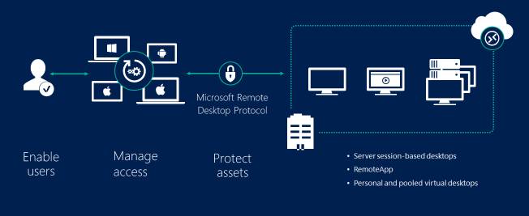

# **Microsoft Azure Virtual Labs (RDS on Azure)**

**"Bring your own device" and mobility** are two of the concepts that are transforming the way that Education is evolving in the era of the cloud. Increasingly, teachers are demanding to IT teams in schools and universities to have their resources, such as applications, available regardless the location they teach at. Besides, students also require to access those kinds of educational applications at any time, at any place and with any device (smartphone, tablet, home PC) they are connecting from.

In this scenario, where the IT teams are facing **the new way of teaching and learning** , they are struggling to find the right solution which meet the demands coming from students and teachers and simultaneously, comply with the security policies of their current technological environment.

**Virtual Lab in Azure** is the **Microsoft Cloud Solution for Education** which provide the suitable combination of infrastructure and services to help IT teams in schools and universities to achieve these common goals:

- To reduce the cost of their current infrastructure on premises of the virtual lab.
- To provide mobility to the students to access the applications of the virtual lab anywhere, anytime and from any device.
- To improve the efficiency of their internal processes in managing permissions to the students, publishing the applications, monitoring the usage or scaling out the platform based on demand of concurrent users.
- To connect the virtual lab to their virtual private network (VPN) to comply with their security policies.

Schools and universities which have already deployed the **Virtual Lab in Azure** are experiencing the benefits of transferring the computation capacity from the user devices to the cloud machines.

Due to the applications used by elementary students are extremely different than those used by, for example, an Engineering student in terms of computer performance, the **solution is completely flexible and adaptive** to serve, using remote sessions, just the applications required by any academic level or student profile.

The customer´s testimony below summarised precisely what the **Virtual Lab in Azure** has supposed to them:

&quot;_In our decision-making process, we considered positively that with Azure we were able to pay just for the real usage as the solution was adapted to our calendars and academic timetables. Besides, it was 25% cheaper than the competitor´s solutions and it met our needs about to customize deployments of the virtual lab. On top of that, we could turn on/off services on the go and the integration with our local IT environment was also met_.&quot;

Luis Fco. Blanco
IT Director
Universidad Pontificia Comillas-ICAI-ICADE [Madrid]

## Getting Started

Follow these steps to deploy a Virtual Labs enviroment in your own subscription.

### Requirements

First, make sure you meet the following requirements:

* An active Azure subscription. It can be a Tria Account, MSDN or Retail Subscription.
* Available quota of cores
  * The basic deployment requires 6 VMs. When you select the size of these virtual machines, you must ensure that the total cores in the deployment do not exceed the subscription capacity (Remember: the default quota of cores is 20).
  
#### Considerations for production environments

* 1 to 10 users per core for Session Host, 200 users per core for Web/Gateway
* Set aside 1 or 2 cores for SMs for other roles
* A-Series VM most cost-effective (D-Series if you need SSDs, but typically don’t)

### Deployment 

1. Click on this button: 
2. Fill the form. You can get info about each field if you hold the cursor over the info icon.
   * Choose your subscription and create or select an existing resource group.
   * Set the admin credentials. An member of Administrator Group account will be created. Remember this credentials to access to VMs after de deployment.
   * Set the name of the domain that will be created and that all the VMs will join it.
   * Set a prefix for the gateway public DNS. The fqdn will look something like 'contoso-gateway.cloudapp.azure.com'.
   * Select the size for Frontend and Backend VMs.
   * Select the size for Session Host VMs.
3. Now wait for the green check in the notifications hub. It will take **1 to 2 hours** for completes the resources deployment.
4. Export and copy self-signed certificates to client computers
   * A self-signed certificate have been used for the deployment. This certificate will need to be installed on the local client machines. See how do it following the steps described in [this guide](Documentation/UserAccessWebCert.md). 
5. Configure Session Collection
   * Set Domain Users as user group
   
### Architecture

Refer to the [solution architecture](Documentation/SolutionArchitecture.md) guide. 

## Learn more about RDS and roles

- [Web Access (RDWeb)](https://technet.microsoft.com/en-us/library/cc731923(v=ws.11&#41;.aspx)
- [Gateway (RDGW)](https://technet.microsoft.com/en-us/library/cc731150(v=ws.11&#41;.aspx)
- [Connection Broker (RDCB)](https://technet.microsoft.com/en-us/library/cc772245(v=ws.11&#41;.aspx)
- [Licensing (RDLic)](https://technet.microsoft.com/en-us/library/cc725933(v=ws.11&#41;.aspx)
- [Session Host (RDSH)](https://technet.microsoft.com/en-us/library/cc742822(v=ws.11&#41;.aspx)

## License

This project has adopted the [Microsoft Open Source Code of Conduct] (https://opensource.microsoft.com/codeofconduct/). For more information, see the [Code of Conduct FAQ] (https://opensource.microsoft.com/codeofconduct/faq/) or contact [opencode@microsoft.com] (mailto:opencode@microsoft.com) with any additional questions or comments.

The MIT License (MIT)

Copyright (c) 2016 Microsoft

Permission is hereby granted, free of charge, to any person obtaining a copy of this software and associated documentation files (the "Software"), to deal in the Software without restriction, including without limitation the rights to use, copy, modify, merge, publish, distribute, sublicense, and/or sell copies of the Software, and to permit persons to whom the Software is furnished to do so, subject to the following conditions:

The above copyright notice and this permission notice shall be included in all copies or substantial portions of the Software.

THE SOFTWARE IS PROVIDED "AS IS", WITHOUT WARRANTY OF ANY KIND, EXPRESS OR IMPLIED, INCLUDING BUT NOT LIMITED TO THE WARRANTIES OF MERCHANTABILITY, FITNESS FOR A PARTICULAR PURPOSE AND NONINFRINGEMENT. IN NO EVENT SHALL THE AUTHORS OR COPYRIGHT HOLDERS BE LIABLE FOR ANY CLAIM, DAMAGES OR OTHER LIABILITY, WHETHER IN AN ACTION OF CONTRACT, TORT OR OTHERWISE, ARISING FROM, OUT OF OR IN CONNECTION WITH THE SOFTWARE OR THE USE OR OTHER DEALINGS IN THE SOFTWARE.
